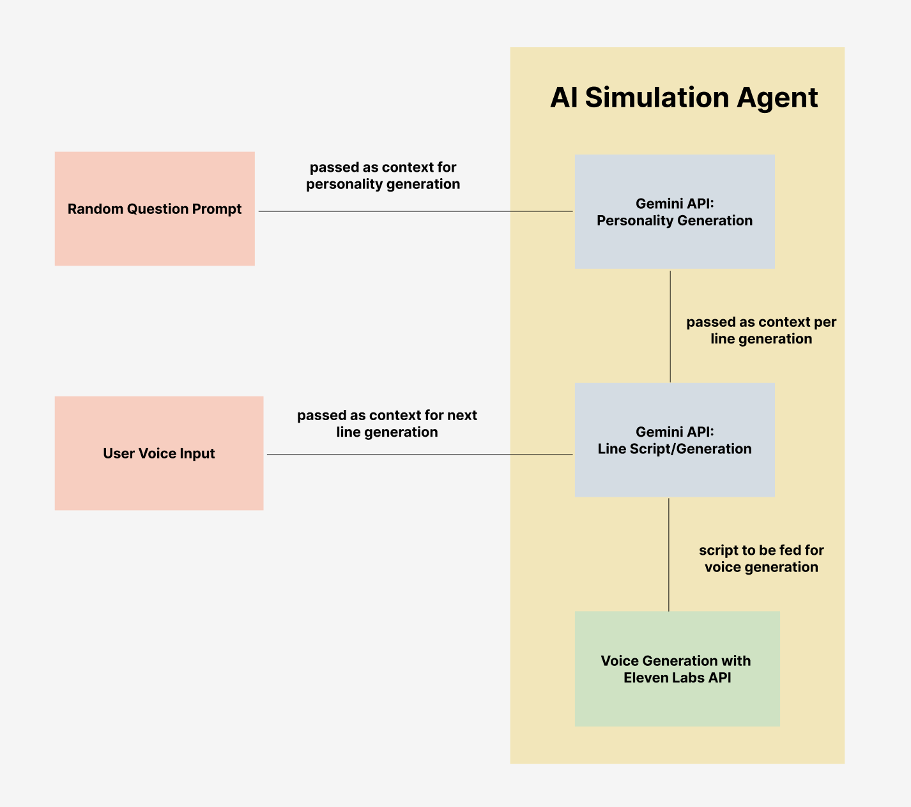

# **FieldReady**

FieldReady is an interactive EMT training platform designed to help trainees build real-world skills through realistic simulations, geographic learning tools, study aids, and communication practice. The system blends AI-powered patient interactions, dynamic map training, and customizable study modules into one cohesive training environment.

---

## **Inspiration**

EMTs must be prepared not only to assess and treat patients, but also to navigate their response areas quickly and accurately. Learning street names, building numbers, and dispatch communication is just as important as clinical skills. FieldReady was created to provide a comprehensive, hands-on environment that helps trainees practice all of these competencies, before ever stepping into the field.

---

## **Key Features**

✨ **AI-Powered Training**: Realistic patient interactions and intelligent feedback  
🎙️ **Voice Integration**: Natural voice recognition and synthesis for immersive training  
🗺️ **Geographic Learning**: Interactive map-based response area memorization  
📊 **Progress Tracking**: Detailed analytics and session history  
🔒 **Secure & Scalable**: JWT authentication, RLS policies, and optimized caching  
📱 **Modern UI**: Responsive design with dark mode support  

---

## **What It Does**

FieldReady includes four core training modules:

### **1. Patient Simulation**

* Generates random EMT scenarios with realistic patient vitals.
* Trainees interact with AI-powered patients through **voice or text**.
* Ask assessment questions and receive natural, context-aware responses.
* AI dispatcher provides:

  * Feedback on assessment technique
  * Guidance through protocols (ABCDE, SAMPLE, vitals gathering, and more)
* Vital signs are dynamically generated based on the scenario.
* Voice synthesis provides lifelike dispatcher and patient dialogue.

## Design Architecture for Patient Situation



---

### **2. Response Area Quiz**

* Interactive map-based learning tool using **Leaflet.js**.
* Helps trainees memorize building locations, street names, and address layouts.
* Users identify buildings or locations on a map to reinforce response-area knowledge.

---

### **3. Flashcards**

* A customizable study system for:

  * EMT protocols
  * Medications and dosages
  * Contraindications
  * Vital sign ranges
* Trainees can build custom decks or review preloaded materials.

---

### **4. Radio Simulation**

* Practice realistic radio communication with AI-powered dispatch calls
* Voice-based response system using Web Speech API
* AI assessment of radio protocol compliance and accuracy
* Session tracking with performance analytics
* Dynamic scenarios pulled from database (locations, complaints, demographics)
* Audio caching for improved performance

---

## **How We Built It**

FieldReady is built using a modern, scalable, and modular stack:

### **Frontend**

* **React 18** + **TypeScript** + **Vite**
* **Tailwind CSS** + **shadcn/ui** for modern, responsive design
* **Web Speech API** for voice recognition and synthesis
* **Supabase Client** for authentication and real-time data
* Interactive mapping using **Leaflet.js**

### **Backend**

* **Node.js** + **Express.js** for RESTful API
* **Supabase** (PostgreSQL) for data persistence
* JWT authentication with Row Level Security (RLS)
* Service layer architecture for clean separation of concerns
* Rate limiting and comprehensive error handling

### **Database**

* **Supabase PostgreSQL** with:
  * Row Level Security (RLS) policies for user data isolation
  * Automated triggers for user progress tracking
  * Audio caching system with 30-day TTL
  * Session and performance analytics storage

### **AI & Voice Integration**

* **Google Gemini 2.0 Flash** for:
  * Real-time scenario generation
  * Line-by-line patient dialogue
  * Intelligent dispatcher feedback
  * Radio protocol assessment and scoring
* **ElevenLabs Turbo v2.5** for high-quality, adaptive voice synthesis
* Server-side API integration for security and caching

### **Mapping**

* Leaflet-based system that uses real building data
* Supports quizzes that reinforce geographic familiarity with response areas

## Getting Started

### Prerequisites

* **Node.js** (v18 or higher)
* **Supabase Account** (free tier works)
* **Google AI Studio API Key** (Gemini)
* **ElevenLabs API Key**

### Quick Setup (5 minutes)

📖 **For detailed setup instructions, see [QUICK_START.md](./QUICK_START.md)**

#### 1. Database Setup

1. Create a Supabase project at [supabase.com](https://supabase.com)
2. Run the SQL schema in Supabase SQL Editor:
   ```bash
   # Copy contents from: backend/database-schema.sql
   ```
3. Create Storage bucket named `radio-audio` (make it public)

#### 2. Backend Configuration

```bash
cd backend
cp .env.example .env
# Edit .env with your API keys:
# - SUPABASE_URL (from Supabase dashboard)
# - SUPABASE_SERVICE_KEY (from Supabase Settings → API)
# - GEMINI_API_KEY (from Google AI Studio)
# - ELEVENLABS_API_KEY (from ElevenLabs dashboard)
```

#### 3. Install & Start Backend

```bash
cd backend
npm install
npm run dev
```

Backend runs on `http://localhost:3001`

#### 4. Frontend Configuration

The frontend is pre-configured to connect to `http://localhost:3001`. 

For Supabase auth, create `frontend/.env`:
```env
VITE_SUPABASE_URL=https://YOUR_PROJECT_ID.supabase.co
VITE_SUPABASE_ANON_KEY=YOUR_ANON_KEY
```

#### 5. Install & Start Frontend

```bash
cd frontend
npm install
npm run dev
```

Frontend runs on `http://localhost:5173`

### 🎉 You're Ready!

1. Open `http://localhost:5173`
2. Sign up/Sign in with Supabase auth
3. Navigate to **Radio Simulation**
4. Click **Start Training** to begin!

---

## Project Structure

```
FieldReady/
├── frontend/                 # React + TypeScript frontend
│   ├── src/
│   │   ├── components/      # Reusable UI components
│   │   ├── pages/           # Page components (Home, PatientSim, RadioSim, etc.)
│   │   ├── services/        # API clients (RadioSimulationAPI, etc.)
│   │   ├── contexts/        # React contexts (Theme, Auth, etc.)
│   │   └── config.ts        # Frontend configuration
│   └── package.json
│
├── backend/                  # Node.js + Express backend
│   ├── src/
│   │   ├── config/          # Environment and configuration
│   │   ├── services/        # Business logic (Scenario, AI, Audio, etc.)
│   │   ├── routes/          # API endpoints
│   │   ├── middleware/      # Auth, error handling, rate limiting
│   │   └── index.js         # Express server
│   ├── database-schema.sql  # Complete database schema
│   └── package.json
│
├── QUICK_START.md           # 5-minute setup guide
├── INTEGRATION_STATUS.md    # Detailed testing & deployment guide
└── README.md                # This file
```

---

## API Documentation

### Backend Endpoints

#### Session Management
- `POST /api/radio/session/create` - Create new training session
- `POST /api/radio/session/complete` - Complete session with stats
- `GET /api/radio/session/:id` - Get session details
- `GET /api/radio/session/active` - Get active session for current user

#### Call Management
- `POST /api/radio/generate-call` - Generate new radio call
- `POST /api/radio/assess-response` - AI assessment of user response

#### Audio & Caching
- `POST /api/radio/get-audio` - Get audio URL (cached or generated)
- `POST /api/radio/cache/cleanup` - Clean expired audio cache

#### Health Check
- `GET /health` - Server health status

All endpoints (except `/health`) require JWT authentication via `Authorization: Bearer <token>` header.

📖 **Full API documentation**: See [backend/README.md](./backend/README.md)

---

## Security Features

* **Server-side API Keys**: All external API keys stored securely in backend
* **JWT Authentication**: Supabase JWT tokens for all protected endpoints
* **Row Level Security**: Database enforces user data isolation
* **Rate Limiting**: 100 requests/minute per IP address
* **Audio Caching**: Reduces API costs and improves performance
* **CORS Protection**: Configured for frontend origin only

---

## Development

### Running Tests

```bash
# Backend tests (when implemented)
cd backend
npm test

# Frontend tests (when implemented)
cd frontend
npm test
```

### Database Migrations

All schema changes should be made in `backend/database-schema.sql` and applied via Supabase SQL Editor.

### Adding New Features

1. **Backend**: Add services in `backend/src/services/`, routes in `backend/src/routes/`
2. **Frontend**: Add API methods to appropriate service file (e.g., `RadioSimulationAPI.ts`)
3. **Database**: Update `database-schema.sql` with new tables/columns
4. **Documentation**: Update this README and relevant docs

---

## Troubleshooting

### Backend Issues
- **Port 3001 already in use**: Change `PORT` in `backend/.env`
- **Database connection fails**: Verify `SUPABASE_URL` and `SUPABASE_SERVICE_KEY`
- **API calls fail**: Check API keys are valid and have sufficient credits

### Frontend Issues
- **CORS errors**: Ensure backend `FRONTEND_URL` matches your frontend URL
- **Auth errors**: Check Supabase credentials in `frontend/.env`
- **Audio not playing**: Verify Storage bucket `radio-audio` exists and is public

### Database Issues
- **RLS blocking queries**: Ensure user is authenticated before accessing protected routes
- **No seed data**: Re-run `database-schema.sql` to populate locations/complaints

📖 **For more troubleshooting**: See [QUICK_START.md](./QUICK_START.md#-troubleshooting)

---

## Contributing

Contributions are welcome! Please:

1. Fork the repository
2. Create a feature branch (`git checkout -b feature/AmazingFeature`)
3. Commit your changes (`git commit -m 'Add some AmazingFeature'`)
4. Push to the branch (`git push origin feature/AmazingFeature`)
5. Open a Pull Request

---

## License

This project is licensed under the MIT License.

---

## Acknowledgments

* **Google Gemini** for powerful AI capabilities
* **ElevenLabs** for realistic voice synthesis
* **Supabase** for backend infrastructure
* **shadcn/ui** for beautiful UI components
* EMT training programs that inspired this project

---